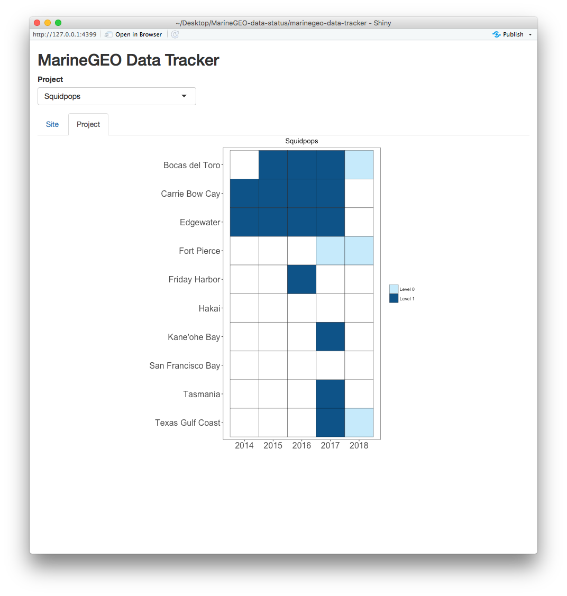

# MarineGEO-data-tracker

R Shiny app that tracks the status of MarineGEO datasets. 

Data Levels:

 - `L0` - raw untidy datasets
 - `L1` - datasets cleaned up and transformed into common standards.

## Dataset Log

See `data/data-status-tracker.csv` for a full list of datasets.

## Screenshots

